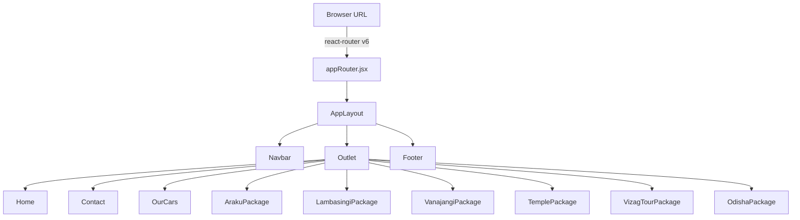
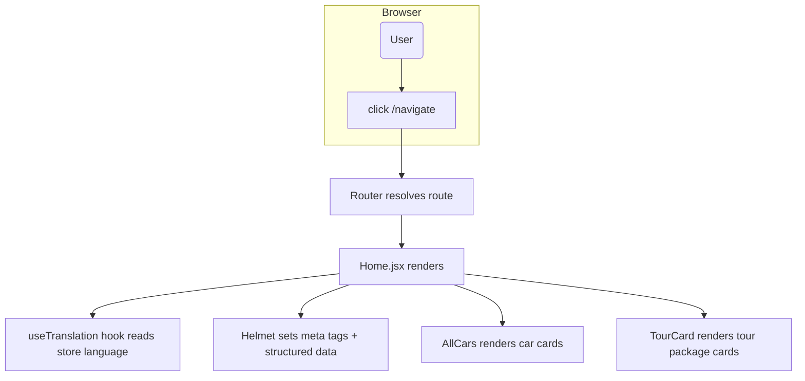

# DreamDestinationsTravels

A **front-end React web application** for renting cars and browsing travel packages around Visakhapatnam, India.

This project is built with **Vite + React** and includes:
- A responsive UI (Bootstrap + custom SCSS)
- Routing with **React Router v6**
- SEO/meta management with **react-helmet**
- A small Redux store for language selection
- Reusable UI components (cars list, tour cards, navbar, footer)

---

## 🚀 Tech Stack

- **Framework:** React 19 (via Vite)
- **Bundler:** Vite
- **Routing:** React Router v6
- **State Management:** Redux Toolkit + React Redux
- **Styling:** Bootstrap 5 + SCSS
- **SEO:** react-helmet
- **Animations:** framer-motion

---

## 🗂️ Project Structure (What’s in `src/`)

- `src/main.jsx` – app entrypoint (mounts React)
- `src/App.jsx` – renders the router provider
- `src/appRouter.jsx` – defines routes + layout (Navbar + Footer)

### Pages (`src/Pages/`)
- `Home.jsx` – landing page
- `Contact.jsx` – contact page
- `OurCars.jsx` – car listing page
- `ArakuPackage.jsx`, `LambasingiPackage.jsx`, `VanajangiPackage.jsx`, `TemplePackage.jsx`, `VizagTourPackage.jsx`, `OdishaPackage.jsx` – tour package pages

### Components (`src/Components/`)
- `Navbar.jsx` – navigation bar
- `Footer.jsx` – footer section
- `AllCars.jsx` – car listing component
- `TourCard.jsx` – tour package card
- `CarouselContainer.jsx` – carousel UI
- `LoaderContainer.jsx` – loading screen

### State & Localization (`src/store/`)
- `store.js` – Redux store setup
- `languageSlice.js` – language selection slice

### Utilities / Data (`src/utils/`)
- `translations.js` – translation dictionary
- `languages.js` – supported languages list
- `carData.js`, `packageData.js`, `homeData.js`, `metaData.js`, `navigation.js`, `siteConfig.js`, `images.js` – app content + config

---

## 🔁 Routing Flow (How navigation works)



---

## 🔄 Data & Rendering Flow (Example: Home Page)



---

## ▶️ Run locally

```bash
npm install
npm run dev
```

Open `http://localhost:5173` (or the URL Vite prints).

---

## 🛠️ Build for production

```bash
npm run build
npm run preview
```

---

## 🔍 Notes / Next Improvements

- Add actual booking flow / backend API
- Add authentication (login/register)
- Replace hard-coded tour data with an API
- Improve SEO image URLs and social share meta tags
